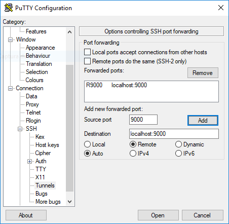
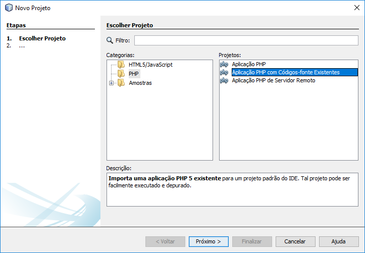
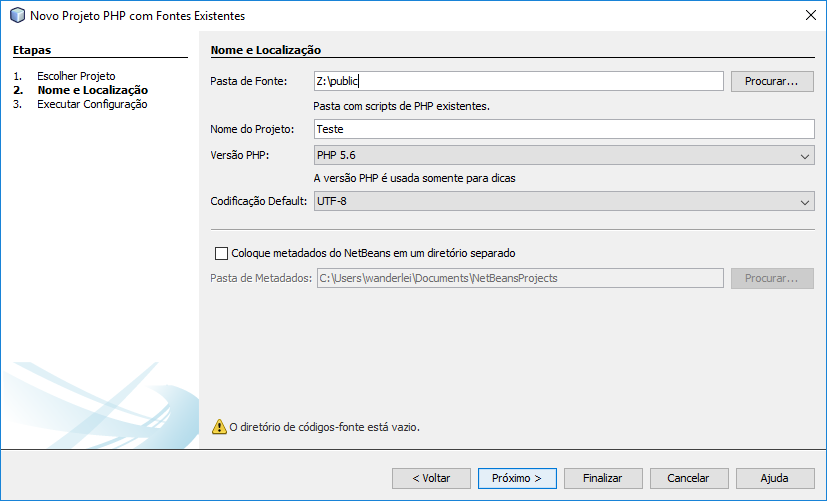
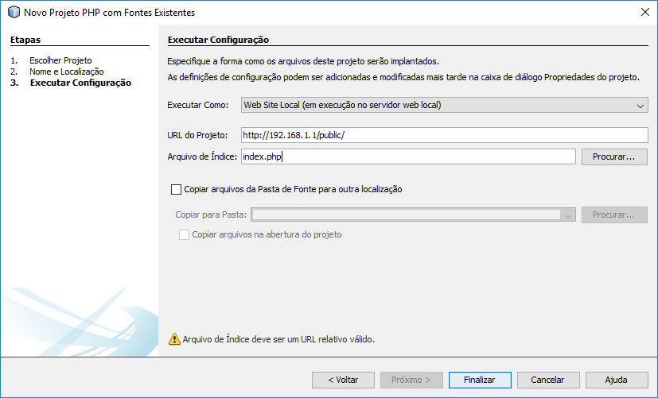
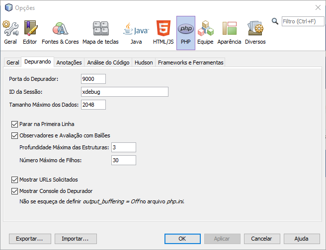

### Configuring PHP + xdebug + netbeans

#### 1) Install php-xdebug extension
````
apt-get install php-xdebug
````


#### 2) After install php-xdebug get the correct path to the "xdebug.so" library and modify in the "zend_extension" and include these line below in the php.ini file
````
zend_extension="/usr/lib/php5/20100525/xdebug.so"
xdebug.default_enable=0
xdebug.remote_enable=1
xdebug.remote_handler=dbgp
xdebug.remote_host=localhost
xdebug.remote_port=9000
xdebug.remote_log="/tmp/xdebug.log"
xdebug.idekey=xdebug
xdebug.cli_color=1
````


#### 3) Configure PuTTY redirect
Select Connection --> SSH --> Tunnels and configure like the image below



#### 4) Configure Netbeans Project
````
Create a new project in Netbeans like the images below
````







#### 5) Configure Netbeans PHP Debug
Tools --> Options --> PHP


